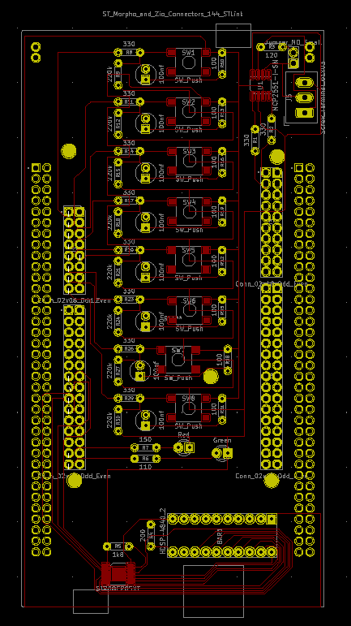

# IO shield for Nucleo boards

This repo contains the source files to make an add-on shield for STM32 Nulceo boards that contains 8 buttons, 8 outputs LEDs and 2 status LEDs.

Note that I haven't verified the functionality of this board.
